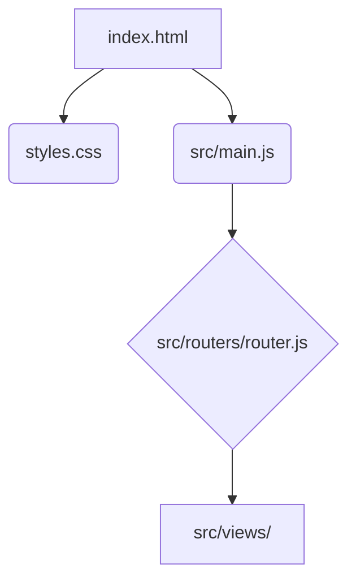

# CodeViz Research Context

> **Note**: This file contains research context from CodeViz. Most recent contexts are at the bottom.

---

## Research Query

I what you to explain in a diagram my code

*Session: 5c71d36d387a1a47b4dca8645dddb34b | Generated: 7/4/2025, 3:56:25 PM*

### Analysis Summary

# Codebase Diagram: Login/SignIn Application

This report outlines the architecture and key components of the Login/SignIn application, detailing their responsibilities and interactions.

## High-Level Architecture

The application is a client-side web application primarily built with HTML, CSS, and JavaScript. It follows a Single Page Application (SPA) pattern, where different "views" are rendered dynamically based on routing.

-   **[index.html](index.html)**: The main entry point, serving as the canvas for the application. It loads the CSS and JavaScript assets.
-   **[styles.css](styles.css)**: Provides the visual styling for all components and views within the application.
-   **[src/](src/)**: Contains all the core JavaScript logic, including the main application entry, routing, and individual view components.



## Mid-Level Components

The `src/` directory encapsulates the application's functional modules.

### **[src/main.js](src/main.js)**

This file serves as the primary JavaScript entry point for the application. It is responsible for initializing the application's core functionalities, such as setting up the router and potentially rendering the initial view.

-   **Purpose**: Application bootstrap and initialization.
-   **Internal Parts**: Likely contains calls to initialize the router and potentially other global setup.
-   **External Relationships**: Interacts with the **[router.js](src/routers/router.js)** to manage navigation.

### **[src/routers/router.js](src/routers/router.js)**

This module handles client-side routing, mapping URL paths to specific application views. It dynamically loads and displays the appropriate content based on the current URL.

-   **Purpose**: Manages navigation and view rendering based on URL changes.
-   **Internal Parts**: Defines routes and their corresponding view components.
-   **External Relationships**: Receives navigation requests (e.g., from **[main.js](src/main.js)** or user interactions) and loads components from the **[src/views/](src/views/)** directory.

### **[src/views/](src/views/)**

This directory contains individual JavaScript files, each representing a distinct view or page of the application. These files are responsible for rendering their specific UI and handling view-specific logic.

-   **Purpose**: Encapsulate the UI and logic for different application screens.
-   **Internal Parts**:
    -   **[app.js](src/views/app.js)**: Likely the main application layout or a wrapper view that contains other views.
    -   **[login.js](src/views/login.js)**: Handles the user login interface and logic.
    -   **[notFound.js](src/views/notFound.js)**: Displays a 404 error page when a route is not found.
    -   **[register.js](src/views/register.js)**: Manages the user registration interface and logic.
-   **External Relationships**: Rendered by the **[router.js](src/routers/router.js)** based on the active route.

## Component Interaction Flow

The application flow begins with **[index.html](index.html)** loading **[main.js](src/main.js)**. **[main.js](src/main.js)** then initializes the **[router.js](src/routers/router.js)**. The **[router.js](src/routers/router.js)** listens for URL changes and, based on its defined routes, dynamically loads and renders the appropriate view from the **[src/views/](src/views/)** directory into the **[index.html](index.html)**.

```mermaid
graph LR
    A[index.html] --> B(Load main.js)
    B --> C(Initialize Router)
    C --> D{Router listens for URL changes}
    D -- URL matches --> E[Load View (e.g., login.js)]
    E --> F(Render View to index.html)
    D -- URL not found --> G[Load notFound.js]
    G --> F
```

